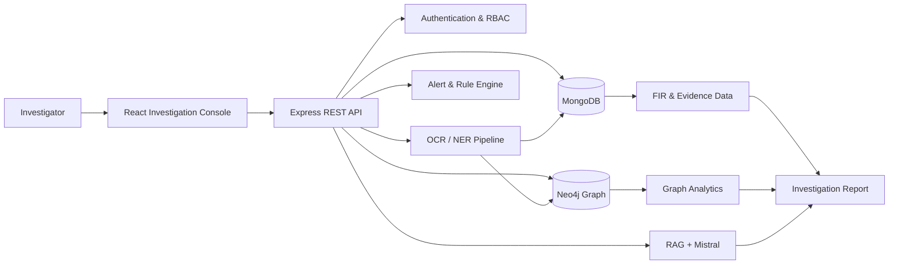
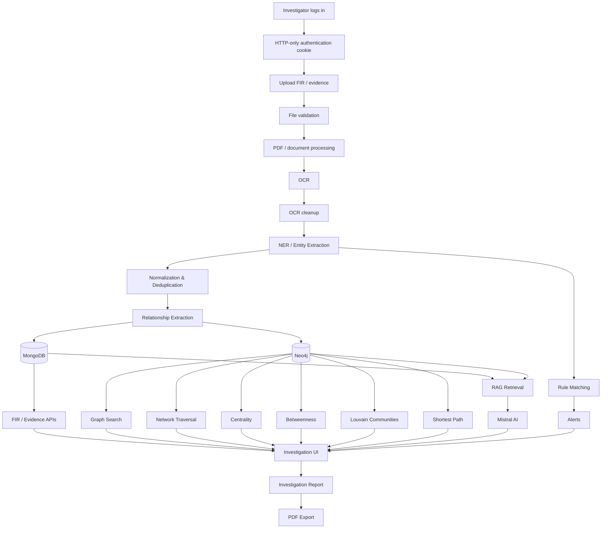
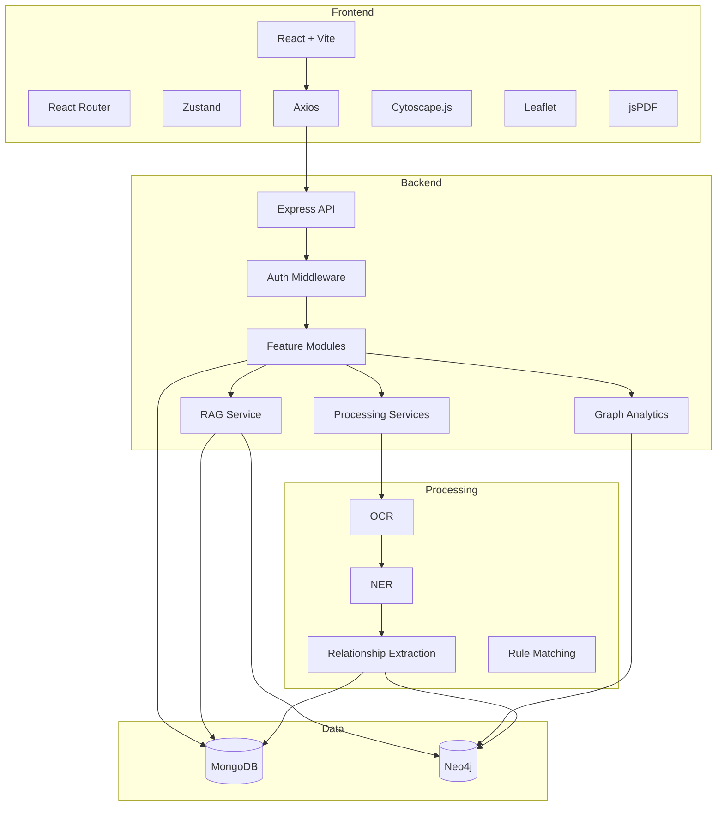
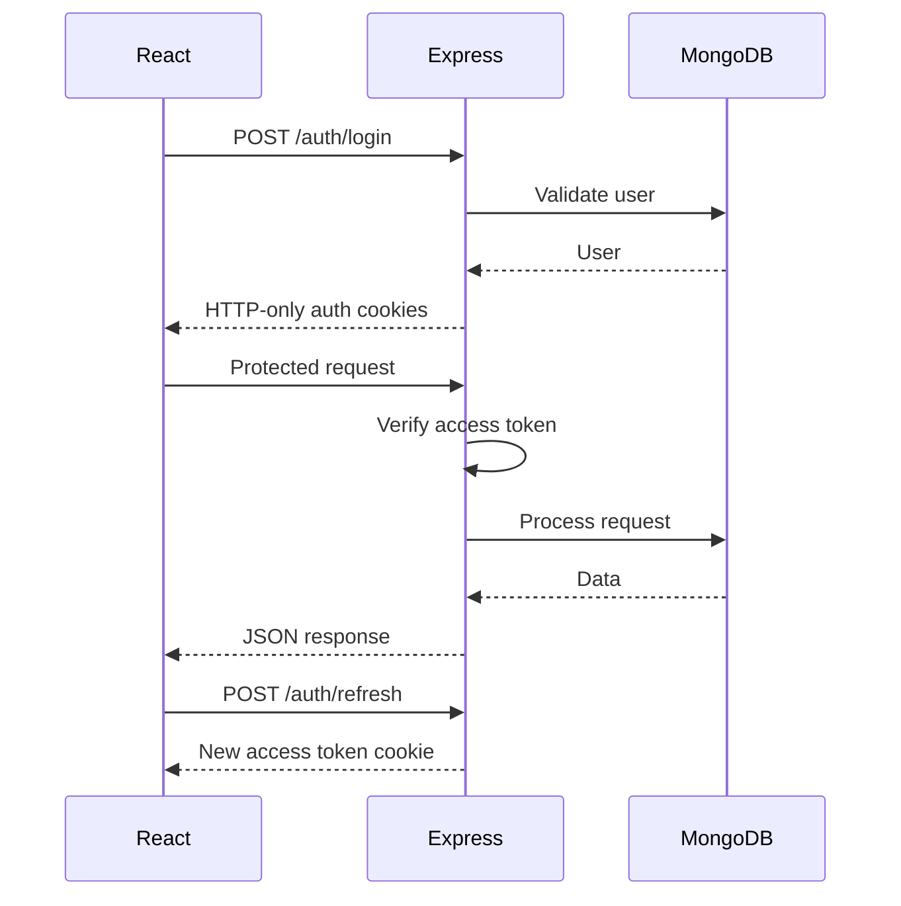
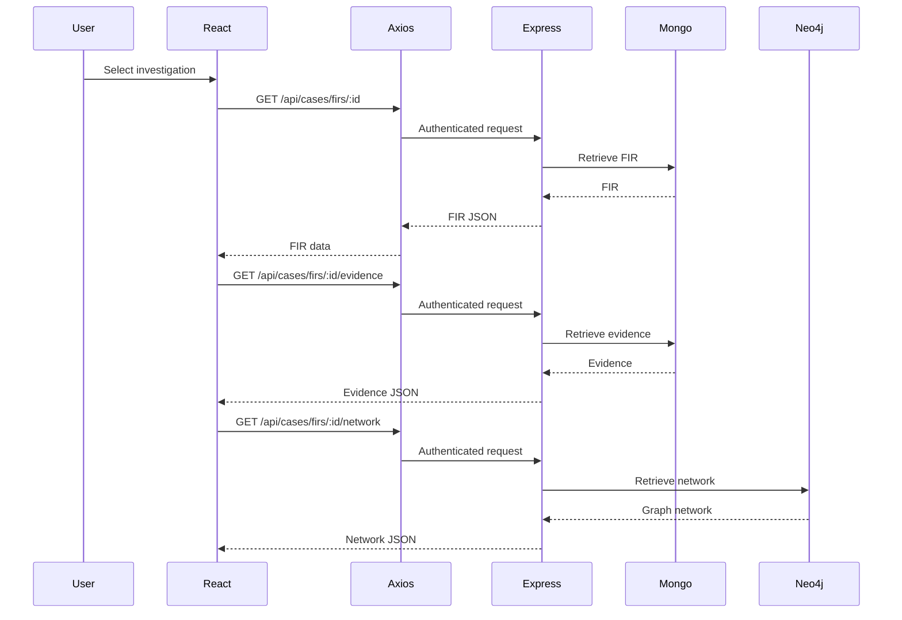

# CrimeGraph AI — AI-Powered Criminal Network Analysis System

> An investigation intelligence platform that combines document processing, entity extraction, graph-based criminal network analysis, rule-based alerts, geospatial intelligence, and retrieval-augmented AI assistance.

## Overview

CrimeGraph AI is a full-stack criminal investigation and intelligence platform designed to help investigators transform fragmented case documents and structured investigative data into connected, searchable intelligence.

The system combines a React-based investigation console with a TypeScript/Express backend, MongoDB for structured application data, and Neo4j for relationship-oriented graph analysis.

Instead of treating people, cases, phones, devices, accounts, locations, organizations, and events as isolated records, the platform models their relationships as a knowledge graph. Investigators can search entities, inspect connections, explore networks, calculate graph metrics, investigate cases, monitor rule-based alerts, view geographic information, query evidence using an AI-assisted RAG workflow, and generate investigation reports.

---

## Problem Statement

Traditional criminal investigation workflows often involve:

* FIRs and evidence stored as separate documents
* Unstructured PDF and OCR-derived information
* Disconnected records for people, phones, devices, accounts and locations
* Manual identification of relationships between entities
* Difficulty discovering indirect connections between suspects and cases
* Limited visibility into important or highly connected entities
* Time-consuming evidence review and report preparation

CrimeGraph AI addresses these problems by providing a unified investigation workspace backed by structured data, graph relationships, analytics and AI-assisted evidence retrieval.

---

## Solution

The platform follows a layered investigation workflow:



The frontend communicates with the backend through REST APIs. The frontend does not directly connect to MongoDB or Neo4j.

---

# Key Features

## Investigation Dashboard

The React frontend provides a centralized investigation interface containing:

* Dashboard overview
* Criminal network visualization
* Entity search
* Entity filtering
* Entity details
* Timeline investigation
* Geographic/map investigation
* Reports and alerts
* FIR selection
* Evidence and network summaries
* PDF intelligence report generation

## Authentication

The backend provides:

* User registration
* Login
* Logout
* Access-token refresh
* Current-user endpoint
* Protected API routes
* Role-based authorization

Authentication uses HTTP-only cookies for access and refresh tokens rather than exposing authentication tokens to frontend JavaScript.

## FIR Management

The system provides structured FIR APIs for:

* Creating FIRs
* Listing FIRs
* Retrieving a FIR
* Updating a FIR
* Deleting a FIR
* Retrieving FIR evidence
* Retrieving FIR-related network information

MongoDB acts as the detailed FIR data source of truth.

## Document Upload and Processing

Authenticated administrators can upload supported investigation documents.

The backend includes processing services for:

* PDF handling
* PDF-to-image conversion
* OCR
* OCR cleanup
* Named Entity Recognition
* Entity normalization
* Entity deduplication
* Relationship extraction
* Entity persistence preparation

The resulting information can be used to populate structured investigative data and the Neo4j knowledge graph.

## Criminal Knowledge Graph

Neo4j represents investigative entities and their relationships as a graph.

Supported entity categories include:

| Node label     | Purpose                           |
| -------------- | --------------------------------- |
| `PERSON`       | People involved in investigations |
| `PHONE`        | Phone/mobile identifiers          |
| `DEVICE`       | Devices associated with entities  |
| `ACCOUNT`      | Financial or other accounts       |
| `LOCATION`     | Geographic locations              |
| `ORGANIZATION` | Organizations                     |
| `CASE`         | Investigation/case records        |
| `EVENT`        | Investigation-related events      |

Relationships include:

| Relationship      | Meaning                              |
| ----------------- | ------------------------------------ |
| `USES`            | Entity uses another entity           |
| `OWNS`            | Entity owns another entity           |
| `LOCATED_AT`      | Entity is associated with a location |
| `INVOLVED_IN`     | Entity is involved in a case         |
| `PARTICIPATED_IN` | Entity participated in an event      |
| `ASSOCIATED_WITH` | General association                  |
| `SEEN_WITH`       | Entities observed together           |
| `TRANSFERRED_TO`  | Transfer relationship                |
| `OCCURRED_AT`     | Event occurred at a location         |
| `RELATED_TO`      | General case/entity relationship     |

The graph schema is designed to support multi-hop investigation rather than only direct record lookup.

---

# Graph Analysis

The backend contains graph analytics for:

### Degree Centrality

Identifies highly connected nodes based on their number of graph connections.

Endpoint:

```text
GET /api/graph/analytics/centrality
```

### Betweenness Centrality

Identifies nodes that frequently occur on paths between other nodes. These can represent important bridges within a network.

Endpoint:

```text
GET /api/graph/analytics/betweenness
```

### Community Detection

The system exposes Louvain community detection through Neo4j Graph Data Science functionality.

Endpoint:

```text
GET /api/graph/analytics/communities
```

### Shortest Path

The system can calculate paths between graph entities to help investigate how two entities are connected.

Endpoint:

```text
GET /api/graph/shortest-path
```

Additional graph analytics endpoints are available under:

```text
/api/analytics
```

including degree, betweenness, communities and shortest-path operations.

---

# AI / ML Functionality

CrimeGraph AI currently combines several AI/data-processing techniques rather than relying on one monolithic model.

## OCR

Uploaded documents can pass through the OCR pipeline to convert document images into machine-readable text.

## Named Entity Recognition

The backend includes NER services for extracting investigative entities from processed text.

Entity processing includes normalization and deduplication before persistence.

## Relationship Extraction

Relationship extraction services identify relationships between extracted investigative entities.

These relationships can subsequently be represented in the knowledge graph.

## Retrieval-Augmented Generation

The RAG subsystem retrieves relevant evidence from stored investigation data before generating an answer.

The implementation retrieves information from sources including:

* OCR results
* Relationship evidence
* Telecom records
* Graph context

The retrieved graph context is combined with evidence before the language model generates an answer.

The backend uses LangChain's Mistral integration and supports configuration through:

```text
MISTRAL_API_KEY
MISTRAL_MODEL
```

RAG endpoint:

```text
POST /api/rag/query
```

The RAG response is designed to include:

* AI-generated answer
* Evidence sources
* Source document identifiers
* Page numbers
* Evidence text
* Confidence information
* Graph context

The system also contains an insufficient-evidence response path rather than assuming that every question can be answered from the available data.

---

# Alerts and Rules

CrimeGraph AI includes a rule-based alert system.

Administrators can create rules based on:

* Entity type
* Match type
* Match value
* Optional case association

Supported matching strategies include:

```text
EQUALS
CONTAINS
REGEX
```

When an extracted/persisted entity matches an active rule, the alert service can create an alert.

Alert statuses are:

```text
NEW
ACKNOWLEDGED
DISMISSED
```

This allows investigators to monitor and manage intelligence alerts from the Reports / Alerts interface.

---

# Maps and Geographic Intelligence

The backend exposes map APIs for:

```text
GET /api/map/overview
GET /api/map/districts/:id
GET /api/map/police-stations/:id
```

The frontend contains map functionality for visual investigation of geographic information.

---

# Complete Data Flow

The intended investigation lifecycle is:



---

# Architecture



---

# Technology Stack

| Layer               | Technology                        |
| ------------------- | --------------------------------- |
| Frontend            | React                             |
| Build tool          | Vite                              |
| Routing             | React Router                      |
| State management    | Zustand                           |
| HTTP client         | Axios                             |
| Graph visualization | Cytoscape.js                      |
| Maps                | Leaflet                           |
| UI icons            | Lucide React                      |
| Animation           | GSAP                              |
| Smooth scrolling    | Lenis                             |
| PDF export          | jsPDF                             |
| Backend             | Node.js + Express                 |
| Backend language    | TypeScript                        |
| Database            | MongoDB                           |
| ODM                 | Mongoose                          |
| Graph database      | Neo4j                             |
| Graph analytics     | Neo4j Graph Data Science          |
| Authentication      | JWT + HTTP-only cookies           |
| Validation          | express-validator / Zod           |
| Password hashing    | bcrypt                            |
| Security middleware | Helmet, HPP, CORS, rate limiting  |
| File upload         | Multer                            |
| OCR                 | Tesseract/OCR services in backend |
| AI/RAG              | LangChain + Mistral               |
| Logging             | Pino + Morgan                     |

---

# Repository Structure

```text
AI-Powered-Criminal-Network-Analysis-System/
│
├── client/
│   ├── public/
│   ├── src/
│   │   ├── animations/
│   │   ├── assets/
│   │   ├── components/
│   │   ├── features/
│   │   │   ├── auth/
│   │   │   ├── graph/
│   │   │   ├── map/
│   │   │   ├── rag/
│   │   │   ├── reports/
│   │   │   ├── timeline/
│   │   │   └── upload/
│   │   ├── hooks/
│   │   ├── lib/
│   │   ├── pages/
│   │   ├── routes/
│   │   ├── store/
│   │   └── styles/
│   ├── package.json
│   └── vite.config.js
│
├── server/
│   ├── src/
│   │   ├── app/
│   │   ├── config/
│   │   ├── constant/
│   │   ├── graph/
│   │   ├── middlewares/
│   │   ├── models/
│   │   ├── modules/
│   │   │   ├── alert/
│   │   │   ├── analytics/
│   │   │   ├── auth/
│   │   │   ├── case/
│   │   │   ├── entity/
│   │   │   ├── File/
│   │   │   ├── graph/
│   │   │   ├── map/
│   │   │   └── rag/
│   │   ├── repository/
│   │   ├── service/
│   │   ├── shared/
│   │   ├── types/
│   │   ├── uploads/
│   │   ├── utils/
│   │   └── server.ts
│   ├── .env.example
│   ├── package.json
│   └── tsconfig.json
│
└── README.md
```

---

# API Documentation

All backend endpoints are prefixed with:

```text
/api
```

Authentication and authorization are applied according to the individual route.

## Authentication

| Method | Endpoint             | Purpose                |
| ------ | -------------------- | ---------------------- |
| POST   | `/api/auth/register` | Register user          |
| POST   | `/api/auth/login`    | Login                  |
| POST   | `/api/auth/refresh`  | Refresh access token   |
| POST   | `/api/auth/logout`   | Logout                 |
| GET    | `/api/auth/me`       | Get authenticated user |

Authentication flow:



---

## FIR / Case APIs

| Method | Endpoint                       | Purpose            |
| ------ | ------------------------------ | ------------------ |
| POST   | `/api/cases/firs`              | Create FIR         |
| GET    | `/api/cases/firs`              | List FIRs          |
| GET    | `/api/cases/firs/:id`          | Get FIR            |
| PATCH  | `/api/cases/firs/:id`          | Update FIR         |
| DELETE | `/api/cases/firs/:id`          | Delete FIR         |
| GET    | `/api/cases/firs/:id/evidence` | Get FIR evidence   |
| GET    | `/api/cases/firs/:id/network`  | Get FIR network    |
| POST   | `/api/cases`                   | Create legacy case |
| GET    | `/api/cases`                   | List legacy cases  |
| GET    | `/api/cases/:id`               | Get legacy case    |
| PATCH  | `/api/cases/:id`               | Update legacy case |

---

## File APIs

| Method | Endpoint                   | Purpose                   |
| ------ | -------------------------- | ------------------------- |
| POST   | `/api/uploads/file`        | Upload investigation file |
| GET    | `/api/uploads/file/search` | Search uploaded files     |

File upload uses multipart form data with the field:

```text
file
```

The upload route is protected and restricted to administrators.

The processing pipeline can subsequently perform document/OCR/entity processing depending on the uploaded data and configured services.

---

## Graph APIs

| Method | Endpoint                         | Purpose                   |
| ------ | -------------------------------- | ------------------------- |
| POST   | `/api/graph/nodes`               | Create graph node         |
| POST   | `/api/graph/relationships`       | Create graph relationship |
| POST   | `/api/graph/resolve`             | Resolve person/entity     |
| GET    | `/api/graph/nodes/:id`           | Get node                  |
| GET    | `/api/graph/nodes/:id/neighbors` | Get neighboring nodes     |
| GET    | `/api/graph/relationships`       | List relationships        |
| GET    | `/api/graph/cases/:id/network`   | Get case network          |
| GET    | `/api/graph/persons/:id/network` | Get person network        |
| GET    | `/api/graph/filtered`            | Get filtered graph        |
| GET    | `/api/graph/search`              | Search graph nodes        |
| GET    | `/api/graph/connections/:id`     | Get node connections      |
| GET    | `/api/graph/shortest-path`       | Find shortest path        |

Graph analytics:

| Method | Endpoint                           | Algorithm                   |
| ------ | ---------------------------------- | --------------------------- |
| GET    | `/api/graph/analytics/centrality`  | Degree centrality           |
| GET    | `/api/graph/analytics/betweenness` | Betweenness centrality      |
| GET    | `/api/graph/analytics/communities` | Louvain community detection |

---

## Analytics APIs

| Method | Endpoint                               | Purpose                   |
| ------ | -------------------------------------- | ------------------------- |
| GET    | `/api/analytics/crime-categories`      | Crime category aggregates |
| GET    | `/api/analytics/districts`             | District aggregates       |
| GET    | `/api/analytics/demographics/gender`   | Gender aggregates         |
| GET    | `/api/analytics/demographics/religion` | Religion aggregates       |
| GET    | `/api/analytics/graph/degree`          | Degree analysis           |
| GET    | `/api/analytics/graph/betweenness`     | Betweenness analysis      |
| GET    | `/api/analytics/graph/communities`     | Community analysis        |
| GET    | `/api/analytics/graph/shortest-path`   | Shortest-path analysis    |

---

## Alert APIs

| Method | Endpoint                     | Purpose             |
| ------ | ---------------------------- | ------------------- |
| POST   | `/api/alerts/rule`           | Create alert rule   |
| GET    | `/api/alerts/rule`           | List rules          |
| PATCH  | `/api/alerts/rule/:ruleId`   | Enable/disable rule |
| GET    | `/api/alerts/alert`          | List alerts         |
| PATCH  | `/api/alerts/alert/:alertId` | Update alert status |

Supported alert states:

```text
NEW
ACKNOWLEDGED
DISMISSED
```

---

## Map APIs

| Method | Endpoint                       | Purpose                |
| ------ | ------------------------------ | ---------------------- |
| GET    | `/api/map/overview`            | Geographic overview    |
| GET    | `/api/map/districts/:id`       | District details       |
| GET    | `/api/map/police-stations/:id` | Police station details |

---

## RAG API

| Method | Endpoint         | Purpose                                         |
| ------ | ---------------- | ----------------------------------------------- |
| POST   | `/api/rag/query` | Ask an evidence-grounded investigation question |

The RAG endpoint is protected by authentication and administrator authorization.

---

# Environment Variables

Create:

```text
server/.env
```

Use `server/.env.example` as the reference.

Never commit actual credentials.

Example structure:

```env
PORT=5000
NODE_ENV=development

DATABASE_URL=<mongodb-connection-string>
CLIENT_URL=http://localhost:5173

ACCESS_TOKEN_SECRET=<strong-secret>
ACCESS_TOKEN_EXPIRES_IN=15m

REFRESH_TOKEN_SECRET=<strong-secret>
REFRESH_TOKEN_EXPIRES_IN=15d

COOKIE_SECURE=false

RATE_LIMIT_WINDOW_MS=900000
RATE_LIMIT_MAX=100

NEO4J_URI=<neo4j-uri>
NEO4J_USERNAME=<neo4j-username>
NEO4J_PASSWORD=<neo4j-password>
NEO4J_DATABASE=neo4j

AURA_INSTANCEID=<aura-instance-id>
AURA_INSTANCENAME=<aura-instance-name>

MISTRAL_API_KEY=<mistral-api-key>
MISTRAL_MODEL=mistral-large-latest
```

For production:

* Use strong randomly generated secrets.
* Enable secure cookies.
* Use production database credentials.
* Restrict CORS to the deployed frontend.
* Never expose database or AI credentials in frontend code.
* Never commit `.env`.

---

# Local Setup

## Prerequisites

Install:

* Node.js
* npm
* MongoDB or a MongoDB-compatible deployment
* Neo4j / Neo4j Aura
* Git

The Mistral API configuration is required for the RAG functionality.

## Clone

```bash
git clone <repository-url>
cd AI-Powered-Criminal-Network-Analysis-System
```

## Backend

```bash
cd server
npm install
```

Create the environment file:

```bash
cp .env.example .env
```

On Windows PowerShell, create/copy the file manually if `cp` is unavailable.

Configure the required environment variables.

Start the backend:

```bash
npm run dev
```

The backend is configured to run on:

```text
http://localhost:5000
```

Useful backend commands:

```bash
npm run dev
npm run build
npm run typecheck
npm start
```

## Frontend

Open another terminal:

```bash
cd client
npm install
npm run dev
```

The Vite development server normally runs on:

```text
http://localhost:5173
```

Frontend commands:

```bash
npm run dev
npm run build
npm run lint
npm run preview
```

---

# Neo4j Setup

Create a Neo4j database or Neo4j Aura instance and configure:

```env
NEO4J_URI=<neo4j-uri>
NEO4J_USERNAME=<username>
NEO4J_PASSWORD=<password>
NEO4J_DATABASE=neo4j
```

The application uses Neo4j for relationship-oriented investigation data.

The graph can contain entities such as:

```text
PERSON
PHONE
DEVICE
ACCOUNT
LOCATION
ORGANIZATION
CASE
EVENT
```

with relationships connecting those entities.

Graph analytics use Neo4j Graph Data Science functionality for centrality and community analysis.

Because graph analytics require graph projections and sufficient graph data, an empty database will not produce meaningful centrality or community results.

---

# Frontend-to-Backend Interaction

The frontend uses Axios to communicate with the backend.

The high-level request flow is:



---

# Security

The backend includes multiple security layers:

* HTTP-only authentication cookies
* JWT access and refresh tokens
* Role-based authorization
* Password hashing with bcrypt
* Helmet security headers
* CORS configuration
* HTTP Parameter Pollution protection
* Rate limiting
* Request validation
* Centralized error handling
* Environment-based secrets
* Separation between frontend and database access

Administrative operations such as graph mutation, FIR management, file upload, analytics and RAG access are protected by authentication and role authorization where implemented.

---

# Testing

The backend repository contains service-level tests around areas including:

* Relationship extraction
* Entity resolution
* Entity graph projection
* Entity foundation functionality

Run the available type/build checks with:

```bash
cd server

npm run typecheck
npm run build
```

For frontend validation:

```bash
cd client

npm run lint
npm run build
```

API behavior can also be tested using Postman or another REST client.

---

# Typical Investigation Workflow

```text
1. Register / authenticate
        ↓
2. Login
        ↓
3. Open Dashboard
        ↓
4. Upload investigation document
        ↓
5. Document processing
        ↓
6. OCR
        ↓
7. Entity extraction / normalization
        ↓
8. Relationship extraction
        ↓
9. Store structured evidence
        ↓
10. Build / update Neo4j relationships
        ↓
11. Search and visualize criminal network
        ↓
12. Run graph analytics
        ↓
13. Review timeline / map
        ↓
14. Monitor rule-based alerts
        ↓
15. Query evidence using RAG
        ↓
16. Generate investigation report
```

---

# Current Implementation vs Future Scope

## Currently Implemented

* React/Vite investigation frontend
* Express/TypeScript backend
* MongoDB persistence
* Neo4j graph integration
* Authentication
* HTTP-only cookie authentication
* Role-based authorization
* FIR CRUD APIs
* Evidence APIs
* File upload
* OCR-related processing services
* Entity extraction services
* Entity normalization/deduplication services
* Relationship extraction services
* Graph search
* Graph traversal
* Shortest-path analysis
* Degree centrality
* Betweenness centrality
* Louvain community detection
* Map APIs
* Timeline/map frontend modules
* Rule-based alerts
* Alert status management
* RAG query endpoint
* Mistral-based answer generation
* Evidence/source retrieval for RAG
* Investigation report UI
* Frontend PDF export

## Future / Planned Improvements

The following should be treated as future scope rather than existing functionality:

* Production-grade automated ingestion pipelines for additional data sources
* More advanced entity-resolution models
* Improved temporal graph analysis
* Advanced anomaly detection
* More sophisticated predictive ML models
* Real-time alert delivery
* WebSocket/SSE-based live investigation updates
* Advanced report templates and server-side report generation
* Expanded evidence provenance and audit trails
* More granular RBAC roles and permissions
* Production deployment automation and CI/CD
* Larger-scale graph optimization and caching
* Automated end-to-end test coverage
* Additional investigator workflow automation

---

# Data and Privacy Considerations

CrimeGraph AI is intended as an investigation-support prototype.

Real-world deployment would require:

* Appropriate authorization and access controls
* Secure storage of sensitive investigative information
* Encryption in transit and at rest
* Comprehensive audit logging
* Data retention policies
* Data minimization
* Privacy and legal compliance
* Human review of AI-generated information
* Strong controls around personally identifiable information

AI-generated answers should be treated as investigation assistance rather than autonomous evidence or final legal conclusions.

---

# Development Notes

The project uses a modular backend architecture:

```text
Routes
  ↓
Controllers
  ↓
Services
  ↓
Repositories / Models / External Systems
```

The frontend follows feature-oriented organization:

```text
features/
├── auth
├── graph
├── map
├── rag
├── reports
├── timeline
└── upload
```

This separation allows individual investigation capabilities to evolve without tightly coupling the entire application.

---

# Contributors

This is a team project developed for the Smart India Hackathon 2026 problem statement around AI-powered criminal network analysis.

The repository contains contributions across:

* Frontend development
* Backend/API development
* Knowledge graph engineering
* OCR and document processing
* Entity extraction
* Graph analytics
* Investigation UI
* Reports and alerts

Individual contribution ownership should be maintained through the repository's Git history and pull requests.

---

# License

No repository license is currently declared. Unless a license is added to the repository, the project should not be assumed to be freely reusable or redistributable.

---

## Project Status

**Status:** Active prototype / hackathon development

CrimeGraph AI demonstrates an end-to-end architecture for combining structured case data, document intelligence, graph-based investigation and AI-assisted evidence retrieval into a single investigation platform.

```

### One important thing before you commit

Your public repository's current root README is essentially empty, while the repository already contains substantial backend/frontend implementation.

Also, the public `main` branch's `client/package.json` currently looks older than the frontend you've been building with me—it only shows React/Vite dependencies there—so **don't use the public `main` package file as the source of truth for your current local branch**. Your local Codex/VS Code inspection should win for the final README.

If you're using **Codex inside VS Code**, the safest approach is to give it your original instruction and tell it **“inspect the local working tree, not GitHub main”**; then it can reconcile any unpushed changes before writing only `README.md`.
```
